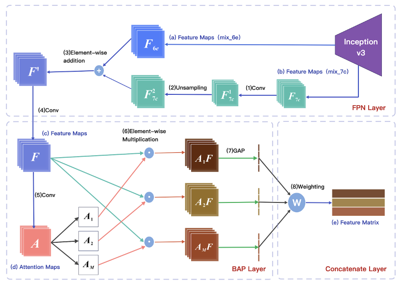

# Feature Augmentation for Fine-Grained Car Classification (FAFCC)

- A neat PyTorch implementation, specifically aiming at the fine-grained classification of vehicles.
- The modification is ****based on WS-DAN (Weakly Supervised Data Augmentation Network) for FGVC (Fine-Grained Visual Classification). (*Hu et al.*, ["See Better Before Looking Closer: Weakly Supervised Data Augmentation Network for Fine-Grained Visual Classification"](https://arxiv.org/abs/1901.09891v2), arXiv:1901.09891)
- The WS-DAN basic model is cited from https://github.com/GuYuc/WS-DAN.PyTorch

# Innovation

---

- We use **multi-layer feature extraction and fusion** to replace single-layer features, and select key features by **weighting the local features**, so as to solve the problem that the discriminative features in the channel are not prominent enough and improve the quality of features. From the perspective of feature enhancement, both **FPN feature pyramid** and **weight** are designed to obtain better feature results. One is to obtain information from different layers and then fuse it. The other is to enhance key features and suppress unimportant features with weight.
- **Basic Framework**
  
    
    
    - **FPN layer :**(a) extracting features from layer 6e;(b) Extracting features from layer 7C;
        - (1)Conv is $1\times1$ *convolution to reduce feature dimension;*
        - *(2) The W and H of $F_{7c}^2$ shall be kept the same as that of $F_{6e}$ by Unsampling;*
        - *(3) Superposition the eigenvalues of the two layers;*
        - *(4) C*onvolution with 3 of kernel size and 1 of padding size eliminates aliasing effect;
    - **BAP layer:** (c)Feature maps obtained by the fusion of  $F_{7c}^2$  and $F_{6e}$;
        - (5) Conv is $1\times1$ convolution operation to obtain attention map;
        - (6) Multiply Feature maps and attention maps respectively to generate $A_kF$;
        - (7) Global average pooling;
    - **Concatenate Layer:**(e)Feature Matrix which will be sent to classifier
        - (8) Weight assignment.
- **Training Process and Testing Process**
  
    
    
    
    

# Performance

---

- PyTorch experiments were done on a 3090 GPU for StanfordCars  and VehicleID, on an A100 GPU for CompCars, the accuracy data are source from the validated results.
    - Particularly, the experiments results from CompCars is achieved based on the image from the web-nature scenario.
    
    | Datasets | Category | Training size | Testing size | Accuracy(%) |
    | --- | --- | --- | --- | --- |
    | StanfordCars | 196 | 8,144 | 8,041 | 94.6 |
    | VehicleID(PKU) | 228 | 8,377 | 8,352 | 98.0 |
    | CompCars | 1,993 | 16,015 | 14,938 | 97.1 |

# Usage

---

## Config

- File Structure
  
    ```python
    -/<datasets>
    -/statistics
    -/fafcc
      └─── datasets
        └─── __init__.py
    		└─── car_dataset.py
    	  └─── ...
      └─── models
        └─── __init__.py
    		└─── inception.py
    		└─── ...
    		└─── wsdan.py
    	└─── config.py
    	└─── eval.py
    	└─── train.py
    	└─── utils
    ```
    
- Configuration
    - Set configuration of datasets in `/home/wsdan/datasets`
        - there are 3 `car_dataset_<dataset>.py`  for the training and testing of three datasets respectively, including `car_dataset_StandfordCars.py` , `car_dataset_CompCars.py`,`car_dataset_VehicleID.py`
        - Specify which dataset you want to adopt in your training and testing then rename it to `car_dataset.py`.
        - prepare the specific datasets in `/home` and set its configuration in `car_dataset.py` , accrodding to the differences among the datasets, here are some of the proper configuration we need to modify.
          
          
            | Param-name | Description |
            | --- | --- |
            | DATAPATH | Dataset’s path |
            | self.num_classes | Dataset’s class number |
            | list_path | annotations’ path |
            | image_path | the path of image directory |
            | images | list consisting of the filename of each image |
            | labels | list consisting of the class annotation of each image |
    - Set some hyper parameters’ configuration in `config.py`
        - Training config
        
        ```python
        GPU = '0'                   # GPU, multiple can be '0,1,2,...'
        workers = 4                 # number of Dataloader workers
        epochs = 160                # number of epochs
        batch_size = 12             # batch size
        learning_rate = 1e-3        # initial learning rate
        ```
        
        - model config
        
        ```python
        image_size = (448, 448)     # size of training images
        net = 'inception_mixed_6e'  # feature extractor
        num_attentions = 32         # number of attention maps
        beta = 5e-2                 # param for update feature centers
        ```
        
        - dataset config
            - if you has previous process and hope to resume training, assign the pretrained model ‘s path  to parameter  `ckpt`
        
        ```python
        tag = 'car'                # 'aircraft', 'bird', 'car', or 'dog'
        # saving directory of .ckpt models
        save_dir = '/home/<dataset pathname>/ckpt/'
        model_name = 'model.ckpt'
        log_name = 'train.log'
        # checkpoint model for resume training
        ckpt = False
        # or ckpt = save_dir + model_name
        ```
        
        - evaluation config
        
        ```python
        visualize = True    # generate the attention while evaluating
        eval_ckpt = save_dir + model_name
        eval_savepath = '/home/<dataset pathname>/visualize/'
        ```
        

## Run

1. `git clone` this repo.
2. Prepare data and **modify DATAPATH** in `datasets/car_dataset.py`.
3. **Set configurations** in `config.py` (Training Config, Model Config, Dataset/Path Config):
4. `$ python3 train.py` for training.
5. `$ tail -f progress.bar` to see training process (tqdm package is required. Other logs are written in `<config.save_dir>/train.log`).
6. Set configurations in `config.py` (Eval Config) and run `$ python3 eval.py` for evaluation and visualization.

## Statistics

### Introduction

- File Structure
  
    ```python
    -/<datasets>
    -/statistics
    	└─── <...>.log
    	└─── <...>.log
    	└─── ...
    	└─── main.py
    -/fafcc
    ```
    
- Introduction
    - use for visualize the training log and analyze the ablation study result

### Usage

1. Put the log file in the `/statistics` 
2. config in `main.py`
    1. legend_label_list: the legend label of the corresponding log file in `log_name`
    2. epoch_loss_scope
    3. epoch_acc_scope
    4. log_name : the pathname of the corresponding log file
3. run `$ python3 [main.py](http://main.py)` 
    1. get the plots in SciView Windows (PyCharm)
    2. get the best performance of each log in Console 

 *e.g. in paper*

1. Comparison on training and testing respectively
   
    
    
2. Comparison among different stage of improvement , evaluated base on validated accuracy
   
    
    
3. log out the overall log data
   
    
    
    
